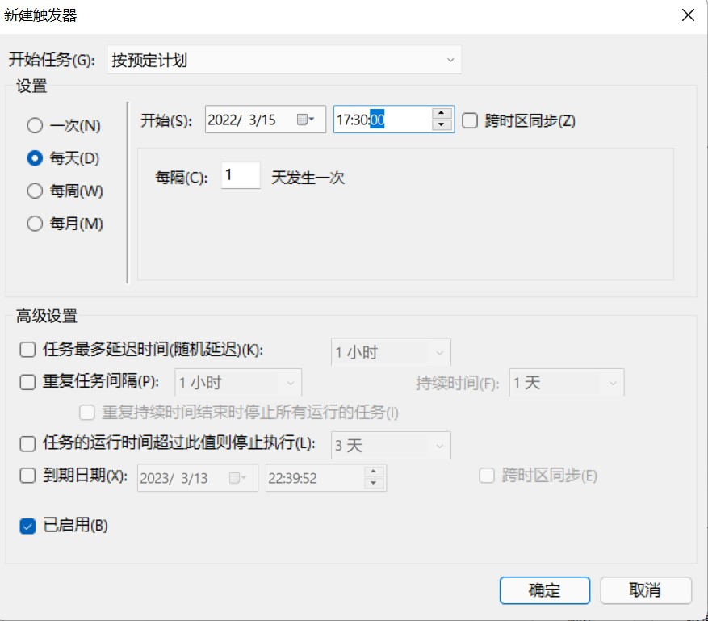

# BUAAAutoClock


有电脑版和iPhone/iPad两种方案，适用于北航师生每日健康打卡。如果你每日体温正常，身体健康，可使用此项目实现每日定时打卡，避免忘记打卡。

**请不要瞒报，体温异常必须如实在小程序上报！**

## 电脑版使用教程

电脑版通过python编写，可通过源代码（需要python环境，兼容各系统）或exe可执行文件（只能用于Windows）使用。

若要实现每日定时打卡，须保持打卡时间电脑处于开机状态。

### 使用准备

1. 通过源代码使用，需要将代码下载到本地，可通过以下两种方法实现：

- 通过git克隆仓库到本地：

```
git clone https://github.com/BienBoy/BUAAautoClock.git
```

- 直接通过下载zip文件，保存到本地。

2. 若通过exe可执行文件使用，可以在右侧`release`中，下载exe可执行文件。通过这种方法，可以不安装python直接使用。

### 环境配置

需要安装好python（没有安装的自行百度安装方法）。然后安装`requests`库：

```shell script
pip3 install requests
```

### 填写用户名及密码

在下载的文件中找到`data.json`文件，在其中对应位置填写好学号及密码。

### 获取上报信息

1. 在浏览器打开网页：https://app.buaa.edu.cn/site/buaaStudentNcov/index 并登录，可以看到打卡页面。
2. 按`F12`或右键选择`检查`打开开发者工具，选择`网络（Network）`。


3. 如实填写信息，点击提交。
4. 在开发者工具中找到名称为save的请求并点击。


5. 点击`负载（Payload）`，再点击`查看源（view source）`，将内容复制到`data.json`的对应位置。


### 设置推送（可选）

#### 基础设置

本项目使用`Server酱`实现打卡结果推送。若要使用推送功能，需前往[Server酱官网](https://sct.ftqq.com/)，注册账号并登录，在[SendKey](https://sct.ftqq.com/sendkey)页面复制自己的SendKey到`data.json`文件`sendkey`对应位置。

#### 高级设置（可选）

可以设置推送方式，在`data.json`文件`channel`对应位置填写推送方式的代码可以设置推送方式，最多可以设置两个。（若设置两个，两个代码应用`|`分割，如：`9|8`）

不同方式的对应代码如下：
> - 方糖服务号=9
> - Android=98
> - Bark iOS=8
> - 企业微信群机器人=1
> - 钉钉群机器人=2
> - 飞书群机器人=3
> - 测试号=0
> - 自定义=88
> - PushDeer=18
> - 企业微信应用消息=66

若不设置，则为在Server酱官网所设置的推送方式。

注：要使用除微信公众号以外的推送方式，需要在手机上完成相应设置。具体操作请前往[Server酱官网对应页面](https://sct.ftqq.com/forward)查看。

### 设置定时打卡

1. 按window键，搜索`任务计划程序`并打开。


2. 点击`创建任务`，填写任务名称。
3. 在`触发器`中，点击新建，设置每天的17 : 30定时打卡。



4. 在`操作`中，点击新建，添加下载的`main.py`文件（或clock文件）。在`起始于`一项中需填入data.json的路径。
5. 在`条件`中，取消勾选`只有在计算机使用交流电源时才启动此任务`。
6. 在`设置`中，勾选`如果过了计划开始时间，立即启动任务`。
7. 点击确定，完成创建。

## iPhone版本使用教程

iPhone版本使用快捷指令编写，使用简单，同时定时打卡设置起来更简单，推荐使用这种方式。

### 环境配置

一般iPhone中自带快捷指令，如果没有，可在AppStore内下载。

可以通过两种方式导入打卡脚本。

- 通过[链接](https://www.icloud.com/shortcuts/412e2c8a38fb4ce48a34283787f71ad9)直接导入（https://www.icloud.com/shortcuts/412e2c8a38fb4ce48a34283787f71ad9）
- 下载本项目iPhone快捷指令文件夹中的.shortcut文件，通过快捷指令打开，即可完成导入

导入后，点击脚本右上角的省略号或长按进入脚本编辑页面，需填写cookie以及payload。

cookie以及payload的获取与电脑版相同。

1. 在浏览器打开网页：https://app.buaa.edu.cn/site/buaaStudentNcov/index 并登录，可以看到打卡页面。
2. 按`F12`或右键选择`检查`打开开发者工具，选择`网络（Network）`。


3. 如实填写信息，点击提交。
4. 在开发者工具中找到名称为save的请求并点击。


5. 在`请求标头`中，可以看到`Cookie`一项

6. 点击`负载（Payload）`，再点击`查看源（view source）`，将内容复制到`data.json`的对应位置。


### 设置定时打卡

可通过快捷指令中的`自动化`实现每日定时打卡。

1. 在自动化页面点击右上角加号
2. 选择创建`个人自动化`
3. 选择`特定时间`
4. 时间设置为每天的17:30，点击下一步
5. 点击`添加操作`，搜索`快捷指令`，选择`运行快捷指令`，出现方框，其中的浅色部分文字`快捷指令`可以点击，点击后选择`BUAA每日体温上报`这一脚本，点击下一步
6. 取消勾选`运行前询问`，点击完成，完成设置。